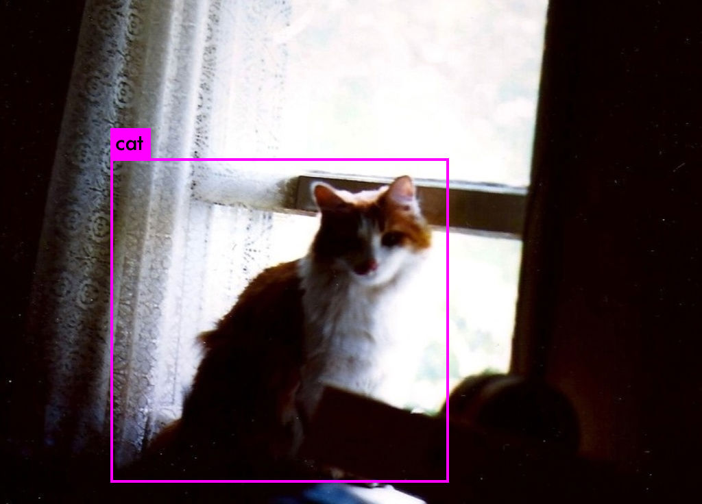
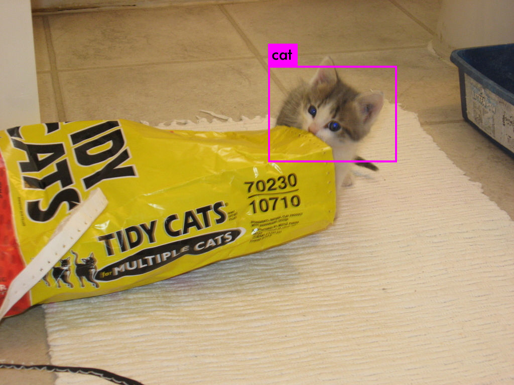
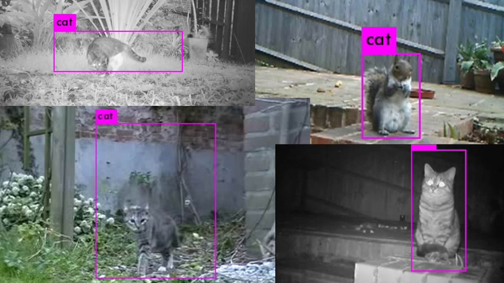

# Cat-detect

This is a slightly optimised version of https://github.com/spmallick/learnopencv, aimed for searching for cats.
Therefore most of the code here was not written by me, only small changes described below.

#### Changes

- Image download tool
    - uses all available cores for downloading
    - variable for inputting how many images were already downloaded (makes it possible to stop download and restart later)
- Overall changes to train for cats instead of snowmen
- Includes weights after 3000 iterations on 1500 images of cats, run as described [here](https://pjreddie.com/darknet/yolo/)

#### Results

After 12 hours of training on a NVIDIA GTX 1060, decent results can be presented




Demo video:
[](https://youtu.be/Oyc-UtUpzDk)

#### Original README


Training YOLOv3 Object Detector - Snowman

1. Install awscli

`sudo pip3 install awscli` 

2. Get the relevant OpenImages files needed to locate images of our interest

`wget https://storage.googleapis.com/openimages/2018_04/class-descriptions-boxable.csv`

`wget https://storage.googleapis.com/openimages/2018_04/train/train-annotations-bbox.csv`

3. Download the images from OpenImagesV4

`python3 getDataFromOpenImages_snowman.py`

4. Create the train-test split

`python3 splitTrainAndTest.py /data-ssd/sunita/snowman/JPEGImages`

Give the correct path to the data JPEGImages folder. The 'labels' folder should be in the same directory as the JPEGImages folder.

5. Install Darknet and compile it.
```
cd ~
git clone https://github.com/pjreddie/darknet
cd darknet
make
```
6. Get the pretrained model

`wget https://pjreddie.com/media/files/darknet53.conv.74 -O ~/darknet/darknet53.conv.74`

7. Fill in correct paths in the darknet.data file

8. Start the training as below, by giving the correct paths to all the files being used as arguments

`cd ~/darknet`

`./darknet detector train /path/to/snowman/darknet.data  /path/to/snowman/darknet-yolov3.cfg ./darknet53.conv.74 > /path/to/snowman/train.log`

9. Give the correct path to the modelConfiguration and modelWeights files in object_detection_yolo.py and test any image or video for snowman detection, e.g.

`python3 object_detection_yolo.py --image=snowmanImage.jpg`

